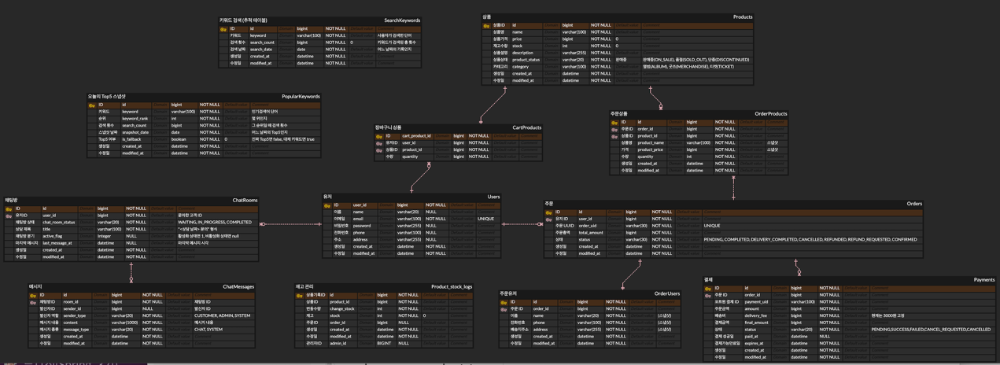

# 🛒 Allday Project Commerce

> **Allday Project** 아티스트의 공식 굿즈·앨범·이벤트 티켓을 판매하는 커머스 플랫폼  
> 회원가입·로그인부터 상품 조회, 장바구니, 주문, 결제 확정, 실시간 채팅 상담까지  
> 커머스의 전체 흐름을 직접 설계하고 구현한 프로젝트입니다.

**프로젝트 기간:** 2026.04.08 ~ 2026.04.28  
**팀명:** A.D.P  
**서버 포트:** 8090

---

## 📋 목차

1. [팀원별 역할](#-팀원별-역할)
2. [기술 스택](#-기술-스택)
3. [핵심 설계 결정 사항](#-핵심-설계-결정사항)
4. [ERD 설계](#-erd-설계)
5. [패키지 구조](#-패키지-구조)
6. [API 명세](#-api-명세)
7. [도전 구현 — 동시성 제어](#-필수-구현--동시성-제어)
8. [필수 구현 — 캐싱 및 인기 검색어](#-필수-구현--캐싱-및-인기-검색어)
9. [도전 구현 — 실시간 채팅](#-도전-구현--실시간-채팅)
10. [도전 구현 — 인덱스 최적화](#-도전-구현--인덱스-최적화)
11. [비즈니스 로직 플로우](#-비즈니스-로직-플로우)
12. [기술적 고려사항](#-기술적-고려사항)
13. [로컬 실행 방법](#-로컬-실행-방법)

---
## 👥 팀원별 역할

| 역할 | 이름 | 담당 업무                                                  |
|------|------|--------------------------------------------------------|
| 👑 리더·개발 | 이재민 | 마일스톤, 인증/인가(JWT), 공통 코드, 주문 도메인, 실시간 채팅, 인기 검색어 |
| 💳 개발·기록 | 문혜린 | 사용자 도메인, 장바구니 상품 도메인, 회의록·SA 문서, API 명세서, ERD, 인덱싱                       |
| 📦 개발 | 박경화 | 상품 도메인, 재고 관리, 상품 검색 캐싱                                          |
| 💰 개발 | 박소영 | 결제 도메인, 주문 및 재고차감 상태 전이, API 명세서, ERD, Docker-Compose , 동시성       

---

## 🛠️ 기술 스택

| 분류 | 기술 |
|------|------|
| Language | Java 21 |
| Framework | Spring Boot 3.5.13 |
| Security | Spring Security + JWT (HttpOnly 쿠키) |
| ORM / Query | Spring Data JPA + QueryDSL 6.10.1 |
| DB | MySQL 8.0 (운영) / H2 (로컬) |
| Cache / Lock | Redis (Lettuce + Redisson 3.51.0), Caffeine |
| 실시간 채팅 | WebSocket + STOMP + Redis Pub/Sub |
| Frontend | Thymeleaf + Vanilla JS |
| 인프라 | Docker, Docker Compose |
| 부하 테스트 | k6 |
| ID 생성 | jnanoid 2.0.0 |

---

## 🔑 핵심 설계 결정사항

| 항목 | 결정 내용                                                                   |
|------|-------------------------------------------------------------------------|
| 인증 방식 | JWT Access Token(30분) + Refresh Token(7일), HttpOnly 쿠키 저장               |
| 주문 식별자 | NanoId 기반 날짜 포함 UID — `ORD-YYYYMMDD-XXXXXXXX` / `PAY-YYYYMMDD-XXXXXXXX` |
| 재고 차감 시점 | 결제 확정(서버 검증 완료) 후 차감. 변경 이력은 `product_stock_logs`에 기록                   |
| 동시성 처리 | Redisson 기반 Redis 분산락 - BLOCKING Watchdog + AOP ,Pessimistic Lock       |
| 주문 스냅샷 | 결제 완료 시 `order_products`(상품명·가격) + `order_users`(주문자 정보) 별도 저장          |
| 페이징 방식 | 주문·장바구니: 커서 기반 무한 스크롤 / 상품 목록: Offset 페이징 (QueryDSL)                    |
| 인기 검색어 | Redis ZSet 실시간 집계 → 1시간마다 DB Write-back → 자정 Top5 스냅샷. Caffeine L1 캐시   |
| 실시간 채팅 | WebSocket + STOMP + Redis Pub/Sub (다중 서버 브로드캐스트 지원)                     |
| 캐시 구조 | L1(Caffeine 로컬) + L2(Redis) CompositeCacheManager 이중 적용                 |
| 배송비 | 3,000원 고정 (50,000원 이상 구매 시 무료)                                          |
| 채팅방 제한 | 유저당 활성 채팅방 1개. `UNIQUE(user_id, active_flag)` NULL 트릭                   |

---

## 🗂️ ERD 설계

<<ERD 전체 다이어그램 이미지>>


## 📁 패키지 구조

```
src/main/java/jpa/basic/alldayprojectcommerce/
├── application/
│   ├── OrderPaymentFacade       # 결제 확정 오케스트레이션
│   └── EventOrderFacade         # 이벤트 선착순 주문 (다양한 락 전략)
│
├── common/
│   ├── ApiResponse              # 공통 응답 {success, code, data, timestamp}
│   ├── CursorResponse           # 커서 기반 페이지네이션 래퍼
│   ├── RestPage                 # Redis 직렬화 호환 Page 구현체
│   ├── cache/                   # CacheName, CacheType, CompositeCacheManager
│   ├── config/                  # Redis, Redisson, WebSocket, QueryDSL, Cache 설정
│   ├── exception/               # GlobalExceptionHandler, ErrorCode, CustomException
│   ├── lock/
│   │   ├── annotation/          # @RedisLock, @RedissonLock
│   │   ├── aspect/              # RedisLockAspect, RedissonLockAspect
│   │   ├── enums/               # RedisLockStrategy (FAIL_FAST, RETRY, BLOCKING)
│   │   ├── repository/          # RedisLockRepository (SET NX + Lua Script 해제)
│   │   └── service/             # RedisLockService, RedissonLockService
│   └── security/
│       ├── auth/                # AuthService, JWT, LoginUser 어노테이션
│       ├── config/              # SecurityConfig, WebMvcConfig, RedisWarmUpRunner
│       ├── cookie/              # CookieUtils
│       └── jwt/                 # JwtTokenProvider, JwtAuthenticationFilter
│
└── domain/
    ├── user/                    # 사용자 (조회·수정·비밀번호 변경·마스킹)
    ├── product/                 # 상품 (단건·목록·검색·재고 관리·캐시 무효화)
    ├── cartProduct/             # 장바구니 (추가·수량변경·삭제·비우기)
    ├── order/                   # 주문 (주문서 생성·조회·상세·이벤트 주문)
    │   └── service/event/       # EventOrderService (이벤트 전용 주문 로직)
    ├── payment/                 # 결제 (생성·확정·멱등성 보장)
    ├── keyword/                 # 인기 검색어 (Redis ZSet + Write-back + Caffeine)
    │   └── scheduler/           # KeywordScheduler (Write-back·자정 초기화)
    ├── chat/                    # 실시간 채팅
    │   ├── redis/               # ChatRedisPublisher, ChatRedisSubscriber
    │   └── scheduler/           # ChatInactivityScheduler (자동 종료)
    └── view/                    # Thymeleaf 뷰 컨트롤러
```

---

## 📡 API 명세

### 인증

| Method | 경로 | 설명 | 인증 |
|--------|------|------|------|
| POST | `/api/auth/signup` | 회원가입 | ❌ |
| POST | `/api/auth/login` | 로그인 (쿠키 발급) | ❌ |
| POST | `/api/auth/logout` | 로그아웃 (쿠키 삭제) | ✅ |
| POST | `/api/auth/reissue` | Access Token 재발급 | ❌ |
| GET | `/api/auth/check-duplicate` | 이메일 중복 확인 | ❌ |

### 사용자

| Method | 경로 | 설명 | 인증 |
|--------|------|------|------|
| GET | `/api/users/me` | 내 정보 조회 (마스킹) | ✅ |
| GET | `/api/users/me/unmasked` | 내 정보 조회 (비마스킹) | ✅ |
| PATCH | `/api/users/me` | 내 정보 수정 | ✅ |
| PATCH | `/api/users/password` | 비밀번호 변경 | ✅ |

### 상품

| Method | 경로 | 설명 | 인증 |
|--------|------|------|------|
| GET | `/api/products` | 상품 목록 조회 (카테고리·키워드 필터) | ❌ |
| GET | `/api/products/{productId}` | 상품 단건 조회 | ❌ |
| GET | `/api/products/search/v1` | 상품 검색 (DB 직접 조회) | ❌ |
| GET | `/api/products/search/v2` | 상품 검색 (캐시 적용) | ❌ |
| PUT | `/api/products/{productId}` | 상품 수정 (캐시 무효화) | ✅ |

### 장바구니

| Method | 경로 | 설명 | 인증 |
|--------|------|------|------|
| POST | `/api/cart` | 상품 추가 (기존 수량 합산) | ✅ |
| GET | `/api/cart` | 장바구니 목록 (커서 페이징) | ✅ |
| PATCH | `/api/cart/{cartProductId}` | 수량 변경 | ✅ |
| DELETE | `/api/cart/{cartProductId}` | 상품 개별 삭제 | ✅ |
| DELETE | `/api/cart` | 장바구니 비우기 | ✅ |

### 주문 / 결제

| Method | 경로 | 설명              | 인증 |
|--------|------|-----------------|------|
| POST | `/api/orders` | 주문서 생성          | ✅ |
| GET | `/api/orders` | 주문 목록 조회        | ✅ |
| GET | `/api/orders/{orderUid}` | 주문서 조회 (결제 전)   | ✅ |
| GET | `/api/orders/{orderUid}/details` | 주문 상세 조회 (결제 후) | ✅ |
| POST | `/api/orders/{orderUid}/payments` | 결제 생성           | ✅ |
| POST | `/api/orders/{orderUid}/payments/{paymentUid}/confirm` | 결제 확정           | ✅ |

### 이벤트 / 검색어 / 채팅

| Method | 경로 | 설명 | 인증 |
|--------|------|------|------|
| POST | `/api/events/products/{productId}/orders` | 이벤트 선착순 주문 | ❌ |
| POST | `/api/keywords/search` | 검색어 기록 | 선택 |
| GET | `/api/keywords/v1/top5` | 인기 검색어 Top5 (실시간) | ❌ |
| GET | `/api/keywords/v2/top5` | 인기 검색어 Top5 (캐시) | ❌ |
| POST | `/api/chat/rooms` | 채팅방 생성/조회 | ✅ |
| GET | `/api/chat/rooms/my` | 내 활성 채팅방 | ✅ |
| GET | `/api/chat/rooms/{roomId}/messages` | 메시지 목록 (커서) | ✅ |
| POST | `/api/chat/rooms/{roomId}/close` | 채팅방 종료 | ✅ |
| GET | `/api/chat/admin/rooms` | 전체 채팅방 목록 | ADMIN |
| POST | `/api/chat/admin/rooms/{roomId}/join` | 상담 시작 | ADMIN |

---

## ⚡ 필수 구현 — 동시성 제어

### 문제 상황

이벤트 티켓 선착순 판매처럼 **순간적으로 수천 명이 동시에 요청**이 쏟아지는 상황에서 데이터 정합성이 깨지는 문제가 발생합니다.

예) 재고 10개인 티켓에 100명이 동시에 주문 → 락 없이는 10개 초과 판매 가능

### 동시성 이슈 검증 테스트

`EventOrderFacadeConcurrencyTest`에서 `ExecutorService` + `CyclicBarrier`를 사용해 100명 동시 요청 시나리오를 구현했습니다.

```java
// 100개 스레드가 동시에 출발
CyclicBarrier startBarrier = new CyclicBarrier(100);
// 락 없는 버전은 정합성이 깨지는 것이 목적, 즉 정상 기대값(10/90/10/0)과 달라야 한다.
boolean isExactlyCorrect =
        result.successCount() == 10 &&
                result.failCount() == 90 &&
                orderCount == 10 &&
                product.getStock() == 0;

assertThat(isExactlyCorrect).isFalse();
```

### Redis 분산 락 구현

#### Lettuce 기반 분산 락 (`RedisLockRepository`)

```java
// SET NX (원자적 락 획득)
Boolean result = redisTemplate.opsForValue()
    .setIfAbsent(key, value, Duration.ofSeconds(timeoutSeconds));

// Lua Script로 본인 락만 원자적 해제
String script = """
    if redis.call('get', KEYS[1]) == ARGV[1] then
        return redis.call('del', KEYS[1])
    else
        return 0
    end
""";
```

#### 3가지 락 전략

| 전략 | 설명 | 적용 시나리오 |
|------|------|---------------|
| **FAIL_FAST** | 락 획득 실패 시 즉시 예외 | 빠른 실패가 필요한 경우 |
| **RETRY** | 최대 15회, 100ms 간격 재시도 | 재시도가 의미 있는 경우 |
| **BLOCKING** | 최대 5초, 50ms 간격 대기 | 처리량보다 정합성 우선 |


### Redisson 기반 분산 락 구현
```java
if (leaseTimeMillis < 0) {
    locked = lock.tryLock(waitTimeMillis, TimeUnit.MILLISECONDS);
} else {
    locked = lock.tryLock(waitTimeMillis, leaseTimeMillis, TimeUnit.MILLISECONDS);
}
```

```java
if (locked && lock.isHeldByCurrentThread()) {
    lock.unlock();
    log.info("[RedissonLock] 락 해제 성공 key={}", key);
}
```


#### AOP 기반 락 적용 (`@RedisLock`, `@RedissonLock`)

비즈니스 코드에서 락 처리 로직을 완전히 분리했습니다.

```java
@RedissonLock(
    key = "'lock:product:' + #productId",
    waitTimeMillis = 10000,
    leaseTimeMillis = -1  // Watchdog 모드 (TTL 자동 연장)
)
public EventOrderResponse createEventOrderWithRedissonLockAopBlockingWatchdog(
        Long productId, Long userId) {
    return eventOrderService.createEventOrder(productId, userId);
}```


```

SpEL 표현식으로 동적 키 생성:
```
'lock:product:' + #productId  →  lock:product:4
```

#### Redisson Watchdog

`leaseTimeMillis = -1` 설정 시 Watchdog이 TTL을 자동 연장합니다.
비즈니스 로직이 예상보다 길어져도 락이 만료되지 않아 안전합니다.

#### 비관적 락

결제 확정 시 `Order` 레코드, 재고 차감 시 `Product` 레코드에 `PESSIMISTIC_WRITE` 락을 적용해 DB 레벨에서 동시 처리를 직렬화합니다.

```java
@Lock(LockModeType.PESSIMISTIC_WRITE)
@Query("SELECT p FROM Product p WHERE p.id = :productId")
Optional<Product> findByIdForUpdate(@Param("productId") Long productId);
```

### 락 버전별 비교 테스트 (v1 ~ v8)

| 방식 | 성공 수 | 최종 재고 | 초과 판매 | p95 | TPS | timeout | lock_fail_count | waitTime | leaseTime | 병목 위치 | 평가 |
|------|--------|----------|----------|------|------|---------|-----------------|----------|-----------|------------|------|
| v1 락 없음 | 998 | ❌ 초과 판매 | ❌ 발생 | 8.31s | 116 req/s | 0 | 0 | - | - | DB 정합성 | ❌ 탈락 |
| v2 DB 비관락 | 100 | 0 | 0 | 2.21s | 413 req/s | 0 | 0 | - | - | DB row lock | ✅ 매우 우수 |
| v3 Redis Retry (TTL) | 100 | 0 | 0 | 7.97s | 119 req/s | 0 | 4 | 5s | 3s | Redis 대기 | ⚠️ 느림 |
| v4 Redis Blocking (TTL) | 100 | 0 | 0 | 5.50s | 169 req/s | 0 | 0 | 10s | 5s | Redis 대기 | △ 경계 |
| v5 Redis FailFast | 6 | ❌ 재고 남음 | 0 | 1.14s | 567 req/s | 0 | 994 | 0 | 3s | lock fail | ❌ 탈락 |
| v6 Redis Retry (Watchdog) | 100 | 0 | 0 | 5.06s | 191 req/s | 0 | 0 | 5s | -1 | Redis 대기 | △ 경계 |
| v7 Redis Blocking (Watchdog) | 100 | 0 | 0 | 3.91s | 226 req/s | 0 | 0 | 10s | -1 | Redis 직렬화 | 🔥 최고 |
| v8 Redis + DB 비관락 | 100 | 0 | 0 | 5.83s | 164 req/s | 0 | 0 | 10s | -1 | Redis + DB | ✅ 안정 but 느림 |

#### 최종 선택: **v7 — Redisson Blocking + Watchdog**

**선택 이유:**
- Blocking 전략으로 재고 100개(티켓 10개 기준)를 모두 소진
- Watchdog으로 비즈니스 로직이 길어져도 TTL 자동 연장 → 안전
- 비관락 중첩(v8) 대비 불필요한 DB 락 오버헤드 없음
- 비관락 대비 DB 부하 분산 가능

---

## 🔍 필수 구현 — 캐싱 및 인기 검색어

### 왜 캐싱을 적용했나?

상품 검색과 인기 검색어는 **반복 요청이 많고 데이터 변경 빈도가 낮은** 전형적인 캐시 적용 대상입니다.
- 검색어가 같으면 결과가 같음 → 매번 DB 조회 불필요
- 인기 검색어는 실시간이 아니어도 됨 → 1분 캐시로 충분

### L1 + L2 복합 캐시 구조 (`CompositeCacheManager`)

```
요청 → L1 Caffeine(로컬 인메모리) → L2 Redis(분산 캐시) → DB
         ↑ 없으면 L2 조회 후 L1 저장
```

```java
// CompositeCacheCacheManager: L1 → L2 순서로 조회
// L2 히트 시 L1에도 저장 (write-back to local)
for (int i = 0; i < caches.size(); i++) {
    ValueWrapper wrapper = caches.get(i).get(key);
    if (wrapper != null) {
        if (i > 0) {
            localCacheManager.putToCache(name, key, wrapper.get()); // L1에 저장
        }
        return wrapper;
    }
}
```

#### 캐시별 설정 (`CacheName` Enum)

| 캐시명 | TTL | 타입 | 최대 크기 |
|--------|-----|------|-----------|
| `productSearch` | 5분 | COMPOSITE (L1+L2) | 500 |
| `productDetail` | 5분 | COMPOSITE (L1+L2) | 500 |
| `top5Keywords` | 1분 | LOCAL (Caffeine만) | 10 |

#### 로컬 캐시의 한계와 Redis 전환 이유

Scale-out 환경에서 서버 A와 서버 B가 각각 다른 로컬 캐시를 가지면 데이터 불일치가 발생합니다.
→ **Redis L2 캐시**로 모든 서버가 동일한 캐시를 공유

### 상품 검색 API — v1 vs v2

#### v1 — DB 직접 조회
```
GET /api/products/search/v1?keyword=볼캡
→ QueryDSL → MySQL LIKE 쿼리 → 매번 DB 왕복
```

#### v2 — 복합 캐시 적용
```
GET /api/products/search/v2?keyword=볼캡
→ L1 Caffeine 확인 → L2 Redis 확인 → DB (캐시 미스 시만)
```

```java
@Cacheable(
    value = "productSearch",
    key = "'product:' + #searchRequest.keyword() + ':' + #pageable.pageNumber + ':' + #pageable.pageSize",
    sync = true  // 동시 DB 조회 방지
)
public RestPage<SearchProductResponse> searchProductsV2(
        SearchProductRequest searchRequest, Pageable pageable) { ... }
```

**캐시 Key 설계:** `keyword:pageNumber:pageSize` 조합으로 키 충돌 방지

### 성능 테스트 결과 (k6)

**테스트 조건:** VU 50명, 30초, 동일 키워드(`apple`) 반복 요청

k6 성능 테스트 결과 — v1(DB) vs v2(캐시) 응답 시간 비교표


| 지표 | v1 (DB) | v2 (캐시) | 개선율 |
|------|---------|-----------|--------|
| 평균 응답시간 | 91.54 ms | 9.29 ms | 89.8% 향상 |
| p95 응답시간 | 126.61 ms | 15.83 ms | 87.5% 향상 |
| TPS | 266.72req/s | 470.44req/s | 76.3% 향상 |

v1 성능 테스트 결과 사진


v2 성능 테스트 결과 사진


### 캐시 무효화 (`@CacheEvict`)

상품 수정 시 관련 캐시를 즉시 삭제합니다.

```java
@Caching(evict = {
    @CacheEvict(value = "productDetail", key = "'product:' + #productId"),
    @CacheEvict(value = "productSearch", allEntries = true)
})
public ProductUpdateResponse updateProduct(Long productId, ProductUpdateRequest request) { ... }
```

### 인기 검색어 아키텍처

#### 전체 흐름

```
검색어 입력
    ↓
정규화 (소문자, 특수문자 제거, 연속 공백 축소)
    ↓
Redis Set으로 중복 체크 (user:{id}:{keyword} or ip:{ip}:{keyword})
    ↓ 중복 아닌 경우만
Redis ZSet score +1 (search:rank:YYYY-MM-DD)
    ↓
TTL = 자정까지 + 1시간
    ↓
[매 1시간] Write-back: Redis ZSet → SearchKeyword DB
    ↓
[자정] Top5 스냅샷 → popular_keywords 저장 → Redis 초기화
    ↓
[서버 재시작] RedisWarmUpRunner: DB 당일 데이터 → Redis 복원
```

#### 중복 방지 전략

- **회원:** `user:{userId}:{keyword}` → Redis Set SADD로 원자적 중복 체크
- **비회원:** `ip:{clientIP}:{keyword}` → IP 기반 하루 1회 제한

#### Fallback 전략

Redis 장애 또는 자정 초기화 직후 데이터가 없을 때:
1. 오늘 `popular_keywords` 스냅샷 조회
2. 없으면 어제 스냅샷 조회
3. 서버 재시작 시 `RedisWarmUpRunner`로 DB → Redis 복원

---

## 💬 도전 구현 — 실시간 채팅

### 아키텍처

```
클라이언트 (SockJS)
    ↓ WebSocket 연결
STOMP CONNECT
    ↓ JWT 검증 (StompChannelInterceptor)
StompPrincipal 설정
    ↓
@MessageMapping("/chat/{roomId}")
    ↓
채팅방 상태·권한 검증
    ↓
chat_messages 저장 + lastMessageAt 갱신
    ↓
Redis Publish (chat:room:{roomId})
    ↓
모든 서버의 ChatRedisSubscriber 수신
    ↓
STOMP /sub/chat/{roomId} 브로드캐스트
```

<<실시간 채팅 아키텍처 구성도>>

### 왜 WebSocket + STOMP?

- **HTTP 폴링** 대비 실시간 양방향 통신 가능, 불필요한 요청 없음
- **순수 WebSocket**만으로는 메시지 라우팅, 구독/발행 패턴 직접 구현 필요 → STOMP로 해결

### Redis Pub/Sub — 다중 서버 문제 해결

단일 서버에서는 WebSocket 세션이 같은 서버에 있어 직접 전달 가능합니다.
**서버 2대 이상**이면 서버 A에 접속한 사용자와 서버 B에 접속한 사용자가 메시지를 주고받을 수 없습니다.

**해결:** Redis 채널(`chat:room:{roomId}`)을 매개로 모든 서버가 메시지를 브로드캐스트합니다.

```java
// Publisher: 어느 서버에서나 Redis 채널에 발행
chatRedisTemplate.convertAndSend("chat:room:" + roomId, message);

// Subscriber: 모든 서버에서 수신 → 자기 서버 구독자에게 전달
simpMessagingTemplate.convertAndSend("/sub/chat/" + roomId, response);
```

### JWT 인증 — HTTP Filter가 아닌 ChannelInterceptor

WebSocket 연결은 HTTP Filter를 통하지 않으므로 `StompChannelInterceptor`에서 CONNECT 시점에 JWT를 검증합니다.

```java
if (StompCommand.CONNECT.equals(accessor.getCommand())) {
    String token = extractToken(accessor); // Authorization 헤더 또는 쿠키에서 추출
    if (!jwtTokenProvider.validateToken(token)) {
        throw new CustomException(ErrorCode.CHAT_UNAUTHORIZED);
    }
    accessor.setUser(new StompPrincipal(userId, role)); // Principal 설정
}
```

### 채팅방 동시 생성 안전 처리

```java
// 1단계: 앱 레벨 — 기존 활성 방 조회
return chatRoomRepository.findByUserIdAndActiveFlag(userId, ACTIVE_FLAG)
    .orElseGet(() -> {
        try {
            // 2단계: REQUIRES_NEW 별도 트랜잭션으로 생성
            return chatRoomCreator.createNewRoom(userId, title);
        } catch (DataIntegrityViolationException e) {
            // 3단계: 동시 생성 충돌 시 재조회
            return chatRoomRepository.findByUserIdAndActiveFlag(userId, ACTIVE_FLAG)
                .map(ChatRoomResponse::from).orElseThrow(...);
        }
    });
```

**유저당 활성 방 1개 보장:** `UNIQUE(user_id, active_flag)` + `active_flag=NULL` 트릭
- 활성 상태: `active_flag = 1` → 유니크 제약 적용
- 종료 상태: `active_flag = NULL` → NULL은 여러 개 허용

### 비활성 채팅방 자동 종료 스케줄러

1분마다 실행, `lastMessageAt` 기준 10분 경과 방을 자동 종료합니다.

```java
// No-Offset 배치 조회 (OOM 방지)
List<ChatRoom> targets = chatRoomRepository.findInactiveRooms(cutOff, lastId, BATCH_SIZE);

// Bulk UPDATE (IN 쿼리로 한 번에 상태 변경 → DB 커넥션 최소화)
chatRoomRepository.bulkCompleteRooms(roomIds);
```

<<실시간 채팅 화면 캡처>>

---

## 📊 도전 구현 — 인덱스 최적화

### 인덱스 설계 기준

대용량 데이터(5만 건 이상)에서 자주 실행되는 쿼리를 선정하여 인덱스를 적용했습니다.

### 적용된 인덱스

#### products 테이블

```sql
-- price 범위 검색 최적화
CREATE INDEX idx_products_price ON products (price);

-- name LIKE 검색 최적화
CREATE INDEX idx_products_name ON products (name);

-- status 필터 + id DESC 커서 페이징 최적화 (복합 인덱스)
CREATE INDEX idx_products_status_id ON products (status, id);

-- category + status 동시 필터링
CREATE INDEX idx_products_category_status ON products (category, status);
```


### EXPLAIN 분석 결과

<<EXPLAIN 실행 계획 Before 사진>>


<<EXPLAIN 실행 계획 After 사진>>


<<EXPLAIN 실행 계획 best 사진>>


| 지표 | 인덱스 적용 전 | 인덱스 적용 후 |
|------|---------------|---------------|
| type | ALL (Full Table Scan) | ref / range |
| key | NULL | 해당 인덱스명 |
| rows | 49680 | 18170 |
| Extra | Using filesort | - |

---

## 🔄 비즈니스 로직 플로우

### 주문 및 결제 플로우

```
[주문서 생성 POST /api/orders]
상품 판매 상태(ON_SALE) 확인 → 재고 확인 → 총 금액 계산
→ orders(PENDING) 저장 → order_products 스냅샷 저장 → orderUid 반환

[결제 생성 POST /api/orders/{orderUid}/payments]
주문 PENDING 상태 확인 → 주문자 정보 존재 확인(name/phone/address)
→ 중복 SUCCESS 결제 여부 확인 → 금액 검증
→ payments(PENDING, expiresAt=+5분) 저장 → paymentUid 반환

[결제 확정 POST /api/orders/{orderUid}/payments/{paymentUid}/confirm]
비관적 락으로 Order 조회 → 주문자 소유권 검증
→ Payment PENDING 확인 (이미 처리된 경우 즉시 반환 — 멱등성)
→ 비관적 락으로 재고 차감
→ order_users 스냅샷 저장
→ orders: PENDING → COMPLETED → DELIVERY_COMPLETED
→ payments: PENDING → SUCCESS
```

### 회원가입 / 로그인 플로우

```
[회원가입]
이메일 중복 확인 → BCrypt 비밀번호 암호화 → users 저장

[로그인]
이메일 조회 → 비밀번호 검증
→ Access Token(30분) + Refresh Token(7일) 발급
→ HttpOnly 쿠키에 저장

[토큰 재발급]
Refresh Token 쿠키 검증 → 새 Access Token 발급 → 쿠키 갱신
```

---

## 🛡️ 기술적 고려사항

### 멱등성 보장

- **결제 확정:** `payment_uid` 기준으로 이미 SUCCESS 상태인 결제가 있으면 중복 처리 없이 현재 상태를 반환 (`ConfirmPaymentResult.alreadyProcessed`)
- **OrderUser 스냅샷:** 결제 재시도로 이미 저장된 스냅샷이 있으면 중복 저장 방지

### 보안

- Access Token + Refresh Token 모두 **HttpOnly 쿠키**로 전달 → XSS 방어
- 마이페이지 조회 시 이메일·이름·전화번호·주소 **마스킹 처리** (`MaskingUtils`)
- JWT 시크릿 키 **최소 256bit(32바이트) 이상 강제 검증**
- 비밀번호 `BCryptPasswordEncoder`로 단방향 암호화

### 커서 기반 페이징

```java
// cursorId 없으면 Long.MAX_VALUE로 최신 데이터부터
long cursor = (cursorId == null) ? Long.MAX_VALUE : cursorId;

// size+1개 조회로 hasNext 판별
List<Order> orders = orderRepository.findByUserIdWithCursor(loginId, cursor, size);
boolean hasNext = rawContent.size() > size;
Long nextCursor = hasNext ? getId.apply(content.getLast()) : null;
```

### 재고 관리

- 재고 차감은 **결제 확정 후** 수행 → 미결제 주문으로 인한 재고 선점 방지
- 재고 0 → 자동 `SOLD_OUT` 전환 / 재고 복구 → 자동 `ON_SALE` 전환
- 모든 재고 변경 → `product_stock_logs` 이력 저장

---

## 🚀 로컬 실행 방법

### 사전 요구사항

- Docker & Docker Compose

### 환경변수 설정

`.env.example`을 참고하여 `.env` 파일을 생성합니다.

```env
SPRING_PROFILES_ACTIVE=prod
DB_URL=jdbc:mysql://localhost:3306/allday_project_commerce
DB_USERNAME=root
DB_PASSWORD=your_password
JWT_SECRET_KEY=your_256bit_secret_key
```

### 실행

```bash
# Docker Compose로 MySQL + Redis + 앱 한 번에 실행
docker compose up -d

# 앱 단독 로컬 실행 (H2 사용)
./gradlew bootRun --args='--spring.profiles.active=local'
```

### k6 부하 테스트

```bash
# 이벤트 선착순 주문 부하 테스트
PRODUCT_ID=4 VUS=1000 BASE_URL=http://app:8090 DB_PASSWORD=12345678 ./run-event-order-compare.sh
```

서버 실행 후 `http://localhost:8090` 접속

---

## 📈 트러블슈팅

### 1. Redis 직렬화 문제 (`LocalDateTime`)

**문제:** Redis에 `Page<SearchProductResponse>` 저장 시 `LocalDateTime` 직렬화 오류

**해결:** `ObjectMapper`에 `JavaTimeModule` 등록 + `RestPage` 커스텀 구현

```java
ObjectMapper objectMapper = new ObjectMapper();
objectMapper.registerModule(new JavaTimeModule());
objectMapper.disable(SerializationFeature.WRITE_DATES_AS_TIMESTAMPS);
```

### 2. 채팅방 동시 생성 Race Condition

**문제:** 동일 유저가 동시에 채팅방 생성 요청 시 `DataIntegrityViolationException` 발생

**해결:** `REQUIRES_NEW` 별도 트랜잭션 + 예외 catch 후 재조회 패턴

### 3. Caffeine 캐시 최대 크기 초과 시 Eviction 지연

**문제:** `maximumSize` 초과 후 Caffeine의 비동기 Eviction으로 실제 크기가 일시적으로 초과

**해결:** 테스트에서 `nativeCache.cleanUp()` 명시적 호출로 강제 정리

---

*© 2026 A.D.P Team — Allday Project Commerce*
